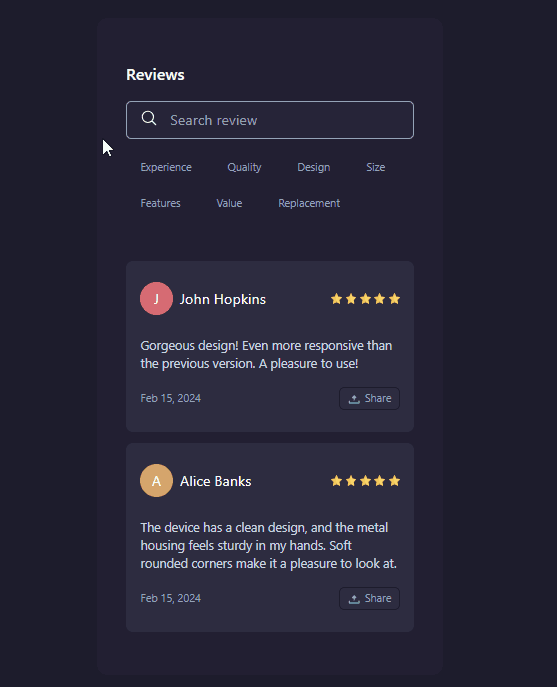

<h1 align="center">Reviews Component</h1> 

  

  <h2><a href="https://veraenders.github.io/reviews-component/">Live</a>
   |  
  <a href="https://github.com/VeraEnders/reviews-component">Code</a></h2>
  
Challenge is provided by <a href="https://icodethis.com/">iCodeThis</a>.
 

## About the project
Interactive Reviews Component for browsing categorized reviews

## Built with
- HTML5
- Tailwind CSS
- JavaScript
- Mobile-first workflow

## Features
### Review Categories
The component offers predefined categories. Users can click on these categories to filter the displayed reviews based on the selected category.

### Review Card
Each review is presented as a card, containing the reviewer's name, a rating representation (using star icons), and the review content. 

## Author
GitHub - [VeraEnders](https://github.com/VeraEnders)